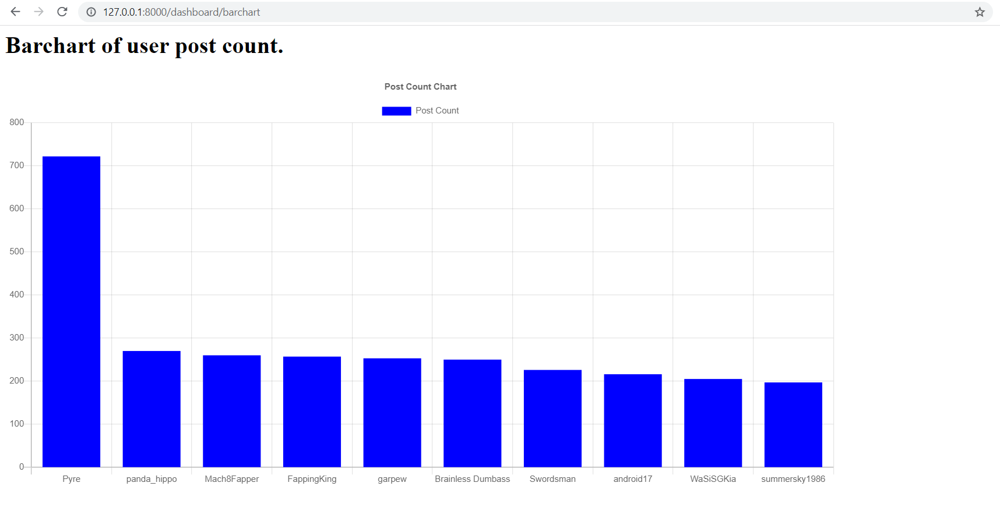

# Assignment 4 Guide
In this assignment, the goal is to retrieve the top 10 users we got from Assignment 3 and display it on the dashboard.
My approach is to use Kafka Streaming to stream the results we got previously from Assignment 3. So instead of writing the stream to the console like we did in Assignment 3, I will be writing it to another Kafka Stream and the topic is called "dashboard_author". This code can be found in [kafka_wordcount.py](spark/kafka_wordcount.py) line 109 to line 121. 

I have also added another field to the PostCount model called "timestamp" which is what I will be using to get the top 10 users to display. I then modified the previous db.sqlite3 to match with this change.

I then created another a [consumer.py](django/hwz_monitor/consumer.py) file which will consume the messages from the topic "dashboard_author" and save it into db.sqlite3. On top of the user_name and post_count, I will also be saving the timestamp which I got from Assignment 3. This timestamp is something I generated in Assignment 3 as seen in line 98 of [kafka_wordcount.py](spark/kafka_wordcount.py).

In the [views.py](django/hwz_monitor/dashboard/views.py) file, the only thing I changed is seen in tne snippet below. Instead of pulling all the objects, I will be pulling only the latest 10 post according to the timestamp.
```
queryset = PostCount.objects.all().order_by('-timestamp')[:10]
```

### The Screenshot of the dashboard:


# Setting up Environment
Start from the base repository folder which is /SMU-IS459. Open a terminal and run the following code below to create an environemnt and install the requirements
```
virtualenv .env && source .env/bin/activate && pip install -r requirements.txt
```

# Running the Program
1. Start hadoop with the following commands. May differ from system to system depending on location of folder and version.
```
sudo service ssh start
cd ~/hadoop/hadoop-3.3.0
sbin/start-dfs.sh
sbin/start-yarn.sh
```

2. Start zookeeper and kafka in 2 separate terminals
```
# TERMINAL 1
cd ~/kafka_2.12-2.8.0/
bin/zookeeper-server-start.sh config/zookeeper.properties
```
```
# TERMINAL 2
cd ~/kafka_2.12-2.8.0/
bin/kafka-server-start.sh config/server.properties
```

3. Start the spark streaming job with Kafka connector in another terminal with the environment activated (from /SMU-IS459 base folder)
```
# TERMINAL 3
source .env/bin/activate
cd spark
spark-submit --packages org.apache.spark:spark-sql-kafka-0-10_2.12:3.1.2 kafka_wordcount.py
```

4. Run Scrapy Spider in another terminal with environment activated (from /SMU-IS459 base folder)
```
# TERMINAL 4
source .env/bin/activate
cd Scrapy/hardwarezone
scrapy runspider hardwarezone/spiders/spider.py
```

5. Run Kafka consumer in another terminal
```
# TERMINAL 5
source .env/bin/activate
cd django/hwz_monitor/
python3 consumer.py
```

6. Run Django in another terminal
```
# TERMINAL 6
source .env/bin/activate
cd django/hwz_monitor/
python3 manage.py runserver
```

7. Open Django Dashboard in a Browser at: http://localhost:8000/dashboard/barchart


### Delete scrapy-output topic from kafka (zookeeper and kafka needs to be started)
```
cd ~/kafka_2.12-2.8.0/
bin/kafka-topics.sh --zookeeper 127.0.0.1:2181 --delete --topic dashboard_author
```